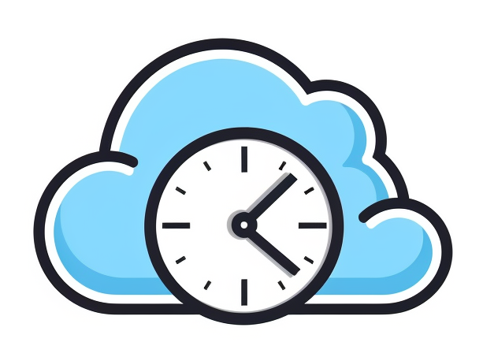
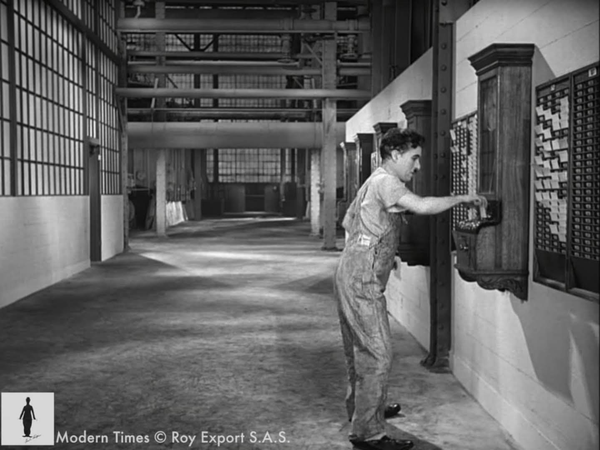

# Time Cloud - CAA 2023 Projet - Team Google



Time Cloud is a cloud-based time logging system designed to automate the tracking of project work hours. It utilizes touchscreen interaction and NFC identification, in conjunction with Google Cloud components, to record work sessions, assign hours to projects, facilitate multi-user collaboration, and generate progress reports.

### Link to the video: 
### Link to the live dashboard: https://dashboard-3zkskaydnq-oa.a.run.app/

## Project structure

#### M5Stack Code
The micropython code for the M5Stack Core 2 is in the [main.py file](M5Stack/main.py). It can be uploaded to the device, for example, using [the web-based UIFlow IDE](https://flow.m5stack.com/).

#### Google Cloud Functions

#### Google Cloud Run - Flask server

#### Google BigQuery Tables
Schema of the BigQuery Tables generated with ```bq show --schema --format=prettyjson [Table]``` in the cloud console.

##### Users
```
[
  {
    "mode": "REQUIRED",
    "name": "id",
    "type": "STRING"
  },
  {
    "mode": "REQUIRED",
    "name": "name",
    "type": "STRING"
  },
  {
    "mode": "REQUIRED",
    "name": "workHours",
    "type": "FLOAT"
  }
]
```

##### Projects
```
[
  {
    "mode": "REQUIRED",
    "name": "id",
    "type": "STRING"
  },
  {
    "mode": "REQUIRED",
    "name": "name",
    "type": "STRING"
  },
  {
    "mode": "REQUIRED",
    "name": "projectHours",
    "type": "FLOAT"
  }
]
```

##### ProjectUsers: defines the many-to-many relationship between Users and Projects
```
[
  {
    "mode": "REQUIRED",
    "name": "userId",
    "type": "STRING"
  },
  {
    "mode": "REQUIRED",
    "name": "projectId",
    "type": "STRING"
  }
]
```

##### Events: An event in written every time a user clocks in or out from a work session
```
[
  {
    "mode": "REQUIRED",
    "name": "userId",
    "type": "STRING"
  },
  {
    "mode": "REQUIRED",
    "name": "logTime",
    "type": "TIMESTAMP"
  },
  {
    "mode": "NULLABLE",
    "name": "projectId",
    "type": "STRING"
  }
]
```

## Hardware


<!---

-->

